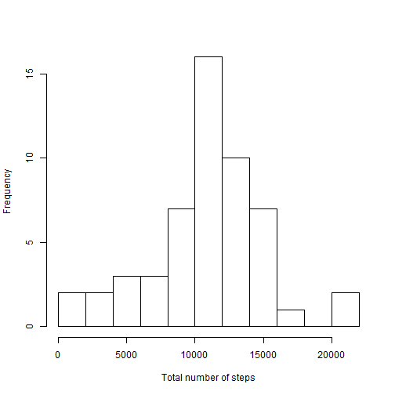
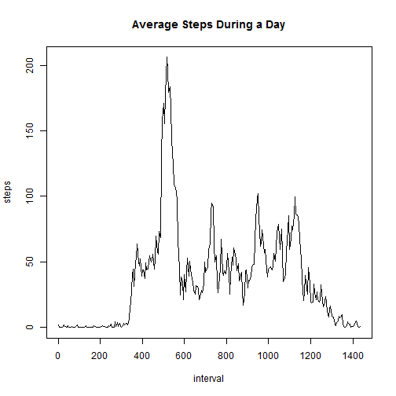
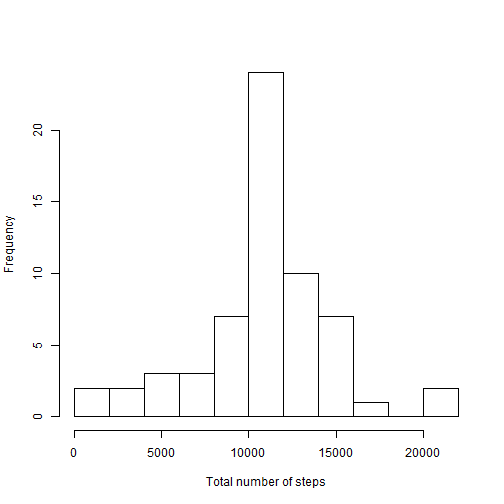
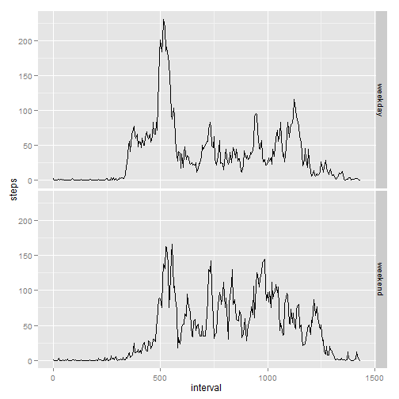

# Reproducible Research: Peer Assessment 1
Author: Vinh N. Pham
<hr/>

## Loading and preprocessing the data
- Download and unzip data file if it is not currently available

```r
dataSource <- "https://d396qusza40orc.cloudfront.net/repdata%2Fdata%2Factivity.zip"
dataZip  <- "activity.zip"
dataFile  <- "activity.csv"

if (!file.exists(dataFile)) {
   download.file(dataSource, destfile=dataZip)
   unzip(dataZip)
}
```
- Read data file

```r
act <- read.csv("activity.csv", header=TRUE, colClasses=c("integer","Date","integer"))
```
- Rescale interval: in the original encoding, the intervals are 5 minutes apart
but encoded as an integer with value 100 corresponds to 1 hour and 0 minutes,
which mean 60 minutes.  As a result, there is a gap between value 55 and 100 in
the original encoding.  For proper calculation, one way is to re-scale the interval
so that the integer value is the number of minutes from midnight.

```r
# function to scale the intervals from original encoding to minutes encoding
IntervalRescale <- function(x) {
   (x %/% 100)*60+ (x %% 100)
}

# function to reverse minutes encoding back to original encoding
ReverseScale <- function(x) {
   (x %/% 60)*100 + (x %% 60)   
}

act$interval <- IntervalRescale(act$interval)
```

## What is mean total number of steps taken per day?
- Filter out missing data

```r
actFiltered <- act[complete.cases(act),]
```

- Histogram of the total number of steps taken each day

```r
filteredDaySum <- aggregate(actFiltered['steps'], actFiltered['date'], sum)
hist(filteredDaySum$steps,breaks=10, xlab="Total number of steps", main="")
```

 

- Calculate and report the **mean** and **median** total number of steps taken per day


```r
(meanTotalSteps <- mean(filteredDaySum$steps))
```

```
## [1] 10766
```

```r
(medianTotalSteps  <- median(filteredDaySum$steps))
```

```
## [1] 10765
```

   + mean total number of steps   = 1.0766 &times; 10<sup>4</sup>
   + median total number of steps = 10765
   
So this is an active individual who takes more than 10000 steps perday

## What is the average daily activity pattern?
- Time series plot of the 5-minute interval (x-axis) and the average number of
steps taken, averaged across all days (y-axis)

```r
filteredIntervalMean <- aggregate(actFiltered['steps'], actFiltered['interval'],mean)
plot(filteredIntervalMean$interval, filteredIntervalMean$steps,type="l",
     xlab="interval", ylab="steps", main="Average Steps During a Day")
```

 

**NOTE: the maximum value in the x-axis is 1440 which is the number of minutes in
a day (24*60).  This is different from the original encoding which the maximum
value is 2355 which correspond to 23:55 PM.  If the original encoding is used,
there would be no data between interval 60 to 100, 160 to 200 ...**

- 5-minute interval, on average across all the days in the dataset,
contains the maximum number of steps

```r
(maxStepInterval1 <- with(filteredIntervalMean, interval[which.max(steps)]))
```

```
## [1] 515
```

So, on average, the maximum number of steps is taken at the interval
515 (minutes from midnight).  If we convert this to the original
scale, it will be

```r
(maxStepInterval2  <- ReverseScale(maxStepInterval1))
```

```
## [1] 835
```

In other words, this individual is most active at around
8:35 (using 24-hour clock)
## Imputing missing values
- Calculate and report the total number of missing values in the dataset

```r
(missingDataNum <- sum(is.na(act$steps)))
```

```
## [1] 2304
```

Missing data number = 2304
- Devise a strategy for filling in all of the missing values in the dataset:  I
choose to replace missing data at each 5-minute interval with the overall average
number of steps at that interval.

- Create a new dataset that is equal to the original dataset but with the missing data filled in.

```r
act1 <- act

# helper function to calculate interval mean
IntervalMean <- function(interval) {
   filteredIntervalMean$steps[filteredIntervalMean$interval==interval]
}

act1$steps[is.na(act1$steps)] <- sapply(act1[is.na(act1$steps),'interval'],IntervalMean)
```

- Make a histogram of the total number of steps taken each day

```r
filledDaySum <- aggregate(act1['steps'], act1['date'], sum)
hist(filledDaySum$steps, breaks=10, xlab="Total number of steps", main="")
```

 

- Calculate and report the mean and median total number of steps taken per day

```r
(meanTotalFilledSteps <- mean(filledDaySum$steps))
```

```
## [1] 10766
```

```r
(medianTotalFilledSteps  <- median(filledDaySum$steps))
```

```
## [1] 10766
```
- Note: 
   + mean total number of steps = 1.0766 &times; 10<sup>4</sup> (not changed)
   + median total number of steps = 1.0766 &times; 10<sup>4</sup> (changed)  
   + The histogram is slightly different (higher at the mean) but not significantly
   + The **mean** doesn't change because we use its values to replace missing value
   + The **median** does change slightly closer (equal) to the **mean** because, after
   all, we do add a number of additional values of the **mean**.

## Are there differences in activity patterns between weekdays and weekends?
- Create a new factor variable in the dataset with two levels – “weekday” and “weekend” indicating whether a given date is a weekday or weekend day.

```r
act1$weekday <- lapply(act1[,'date'],
                       function(x) {
                          if (weekdays(x) %in% c("Saturday", "Sunday"))
                             "weekend"
                          else
                             "weekday"})
weekdayAct <- act1[act1$weekday == "weekday",]
weekendAct <- act1[act1$weekday == "weekend",]
weekdayIntervalMean <- aggregate(weekdayAct['steps'], weekdayAct['interval'],mean)
weekendIntervalMean <- aggregate(weekendAct['steps'], weekendAct['interval'],mean)
weekdayIntervalMean$weekday <- "weekday"
weekendIntervalMean$weekday <- "weekend"
combinedIntervalMean <- rbind(weekdayIntervalMean, weekendIntervalMean)
```

- Make a panel plot containing a time series plot of the 5-minute interval (x-axis) and the average number of steps taken, averaged across all weekday days or weekend days (y-axis)

```r
library(ggplot2)
qplot(interval, steps, data=combinedIntervalMean, facets = weekday ~ ., geom="line")
```

 

**NOTE: the maximum value in the x-axis is 1440 which is the number of minutes in
a day (24*60).  This is different from the original encoding which the maximum
value is 2355 which correspond to 23:55 PM.  If the original encoding is used,
there would be no data between interval 60 to 100, 160 to 200 ...**

Comments: There are differences in activity patterns between weekdays and weekends.
During weekdays, activity peaks in early morning and slows down significantly during
the day.  However, in the weekend, even though early morning activity is not as
high as in weekdays but high level of activity is peaked as many points in the day.
